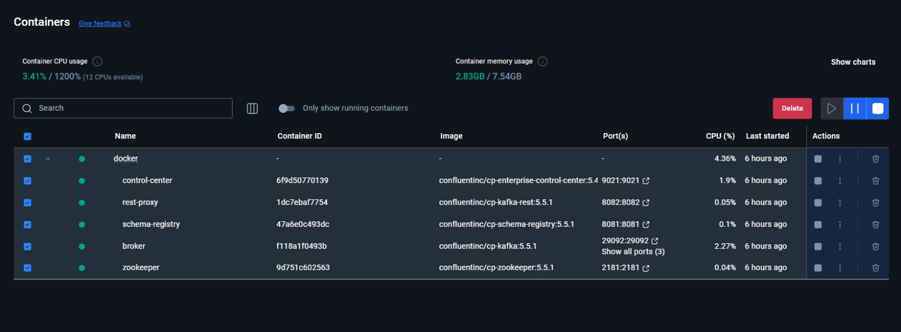
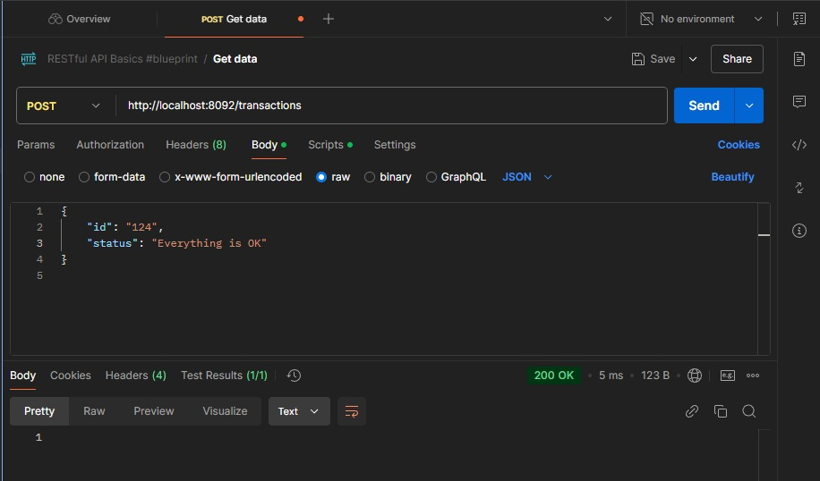
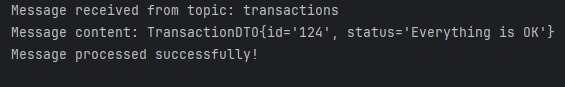
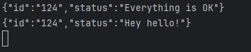

# 📬 Kafka Messaging System

## 📝 Description

This project is a **Kafka Messaging System** developed in Java, leveraging Spring Boot to implement two microservices: a **Producer** and a **Consumer**. The communication between these microservices is asynchronous, utilizing Kafka as the messaging platform. The system also integrates **Docker Compose** for container orchestration and supports a **Dead Letter Queue (DLQ)** for failed message handling.

## 📑 Table of Contents

- [Features](#features)
- [Requirements](#requirements)
- [Environment Setup](#environment-setup)
- [How to Run the Project](#how-to-run-the-project)
- [Directory Structure](#directory-structure)
- [Demonstration](#demonstration)

## 🚀 Features

- **Producer Service:**
  - Sends messages containing a transaction ID and status to a Kafka topic.
  - Implements detailed logging using Log4j2.
  - Handles errors during message production and logs them.

- **Consumer Service:**
  - Listens to the Kafka topic to consume and process messages.
  - Routes failed messages to a **Dead Letter Queue (DLQ)** after retries.
  - Detailed logging for success and failure cases.

- **DLQ (Dead Letter Queue):**
  - Stores failed messages for further analysis.
  - Generates logs for every message sent to the DLQ.

- **Docker Compose:**
  - Configures Kafka, Zookeeper, Producer, and Consumer services in a containerized environment.

## 🧰 Requirements

Ensure the following tools are installed on your machine:

- [Java JDK 17+](https://www.oracle.com/java/technologies/javase-jdk17-downloads.html)
- [Apache Kafka](https://kafka.apache.org/): Configured and running.
- [Docker](https://www.docker.com/) and [Docker Compose](https://docs.docker.com/compose/): For containerized deployment.
- [Maven](https://maven.apache.org/install.html): For dependency management and building the project.

## 🛠 Environment Setup

Before running the project, follow these steps:

1. **Clone the repository:**
    ```bash
    git clone https://github.com/VictorHugoCC/SP_SpringBoot_AWS_kafka_producer-consumer.git
    cd SP_SpringBoot_AWS_kafka_producer-consumer
    ```

2. **Start Docker containers:**
    Ensure Docker is running and execute the following command:
    ```bash
    docker-compose up
    ```

3. **Verify Kafka services:**
   - Kafka and Zookeeper should be running as containers.
   - Producer and Consumer services should start without errors.

## 🚀 How to Run the Project

1. **Producer Service:**
   Navigate to the `producer` directory and run:
   ```bash
   mvn spring-boot:run
   ```

2. **Consumer Service:**
   Navigate to the `consumer` directory and run:
   ```bash
   mvn spring-boot:run
   ```

3. **Testing Message Flow:**
   - Send a message using the Producer API (`POST /transactions` with JSON payload).
   - Observe the Consumer logs for message consumption and processing.

## 📂 Directory Structure

- **producer:** Contains the Producer microservice codebase.
  - **controller:** API endpoints for message production.
  - **service:** Business logic for message production.
  - **config:** Kafka configuration for the Producer.
  - **resources:** `application.properties` for service configuration.


- **consumer:** Contains the Consumer microservice codebase.
  - **controller:** Logic for message consumption.
  - **service:** Handles message processing and routing to the DLQ.
  - **config:** Kafka configuration for the Consumer.
  - **resources:** `application.properties` for service configuration.

- **logs:** Directory for storing application logs.
- **assets:** Contains demonstration media (images, gifs, or diagrams).
- **docker-compose.yml:** Configuration file for setting up Kafka, Zookeeper, Producer, and Consumer services.

## 🎬 Demonstration

Here are some examples of the project in action:

### Docker Setup


### Example 1
Json:


Exit on consumer:
### Example 2


Acess this part using the command `kafka-console-consumer --bootstrap-server localhost:9092 --topic transactions --from-beginning`
### Checkout at kafka-console-consumer to se more informations
